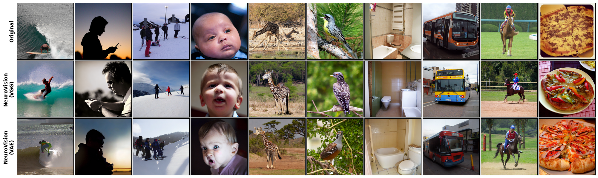

# NeuroVision

Repository for the **NeuroVision** project, a dual-branch fMRI-to-image decoding architecture trained on the [Natural Scenes Dataset (NSD)](https://naturalscenesdataset.org/). The system reconstructs visual stimuli from cortical activity signals by combining semantic and structural conditioning over Stable Diffusion.

<p align="center">
  
  <br>
  <em><b>Fig. 1.</b> Qualitative comparison between original visual stimuli (top row) and reconstructions generated by NeuroVision VGG (middle row) and VAE (bottom row) variants.</em>
</p>

---

## 🧠 Overview

NeuroVision addresses the inverse problem of recovering perceptual content encoded in fMRI brain signals. The architecture operates through two parallel branches:

- **Semantic Branch:** an MLP projects full-brain fMRI activity (`nsdgeneral` mask, 15724 voxels) into CLIP embedding space, conditioning Stable Diffusion via IP-Adapter.
- **Structural Branch:** a CNN operates exclusively on visual ROI signals (4657 voxels) and implements two geometric conditioning strategies:
  - **VGG variant:** predicts hierarchical VGG16 features used as a pseudo-depth map via ControlNet.
  - **VAE variant:** maps cortical activity to VAE latents, initializing the diffusion process via image-to-image.

At inference, a **stochastic ensemble** of $N=16$ candidates is generated and the reconstruction with highest CLIP similarity to the predicted embedding is selected.

<p align="center">
  
  <br>
  <em><b>Fig. 2.</b> Dual-branch architecture of NeuroVision.</em>
</p>

---

## 📂 Project Structure

```text
NeuroVision/
│
├─ models/
│  ├─ cnn_vae.py          # CNN: Visual ROIs → VAE latents
│  ├─ cnn_vgg.py          # CNN: Visual ROIs → VGG16 features
│  └─ mlp.py              # MLP: fMRI → CLIP embeddings
│
├─ scripts/
│  ├─ compute_stats.py    # Compute normalization statistics over training set
│  ├─ inference.py        # Run inference and ensemble selection
│  ├─ load_data.py        # Data loading and preprocessing
│  ├─ split_data.py       # Train/test split by unique stimuli
│  ├─ train.py            # Train a single model branch
│  ├─ train_all.py        # Train all branches sequentially
│  └─ visualize.py        # Qualitative results and reconstructions
│
├─ config.py              # Hyperparameters and path configuration
├─ main.py                # Run program
├─ .gitignore
└─ LICENSE
```

---

## 📊 Results

Quantitative evaluation over 100 test samples using the standard 8-metric protocol from the neural decoding literature:

| Method | PixCorr ↑ | SSIM ↑ | Alex(2) ↑ | Alex(5) ↑ | Incep ↑ | CLIP ↑ | Eff ↓ | SwAV ↓ |
|---|---|---|---|---|---|---|---|---|
| **NeuroVision (VGG)** | 0.087 | 0.218 | 86.0% | 91.0% | 85.0% | 93.0% | 1.184 | 0.780 |
| **NeuroVision (VAE)** | 0.327 | 0.323 | 81.0% | 91.0% | 83.0% | 95.0% | 1.162 | 0.743 |
| [BrainDiffuser](https://github.com/ozcelikfu/brain-diffuser) | 0.254 | 0.356 | 94.2% | 96.2% | 87.2% | 91.5% | 0.775 | 0.423 |
| [MindEye](https://github.com/MedARC-AI/fMRI-reconstruction-NSD) | 0.309 | 0.323 | 94.7% | 97.8% | 93.8% | 94.1% | 0.645 | 0.367 |
| [MindEye2](https://github.com/MedARC-AI/fMRI-reconstruction-NSD) | 0.322 | 0.431 | 96.1% | 98.6% | 95.4% | 93.0% | 0.619 | 0.344 |

> Note: reference methods were evaluated on a standard 982-image NSD test partition; NeuroVision was evaluated on 100 samples from a subject-specific 90/10 split. Comparison is referential.

---

## ✅ Requirements

- **Python** 3.8+
- **CUDA** GPU recommended (experiments run on NVIDIA A100 80GB via Google Colab)

---

## 🚀 Getting Started

```bash
# 1) Clone the repository
git clone https://github.com/felipeperassi/NeuroVision.git
cd NeuroVision

# 2) Install dependencies
pip install torch torchvision diffusers transformers open_clip_torch
pip install numpy pandas matplotlib scikit-learn

# 3) Configure paths and hyperparameters
#    Edit config.py to set your NSD data directory and training settings

# 4) Run training and inference
python main.py
```

> Download the NSD data from naturalscenesdataset.org. Set the paths to betas_fithrf_GLMdenoise_RR and prf-visualrois in config.py before running.
---

## 📄 License

Distributed under the **MIT License**. See the `LICENSE` file for more details.
